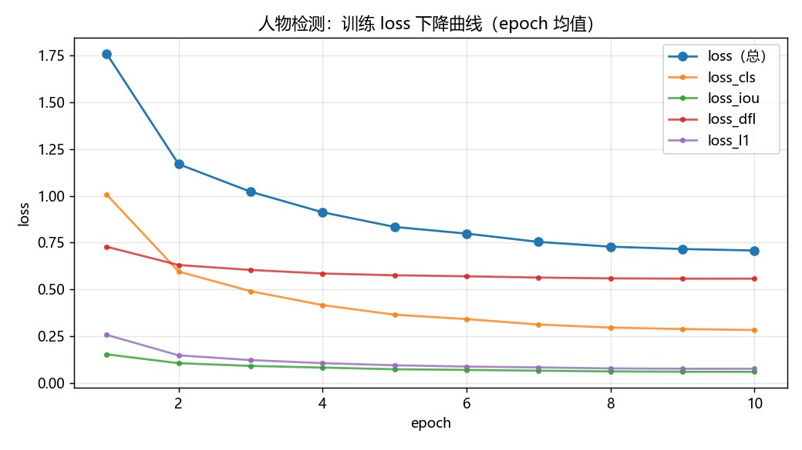
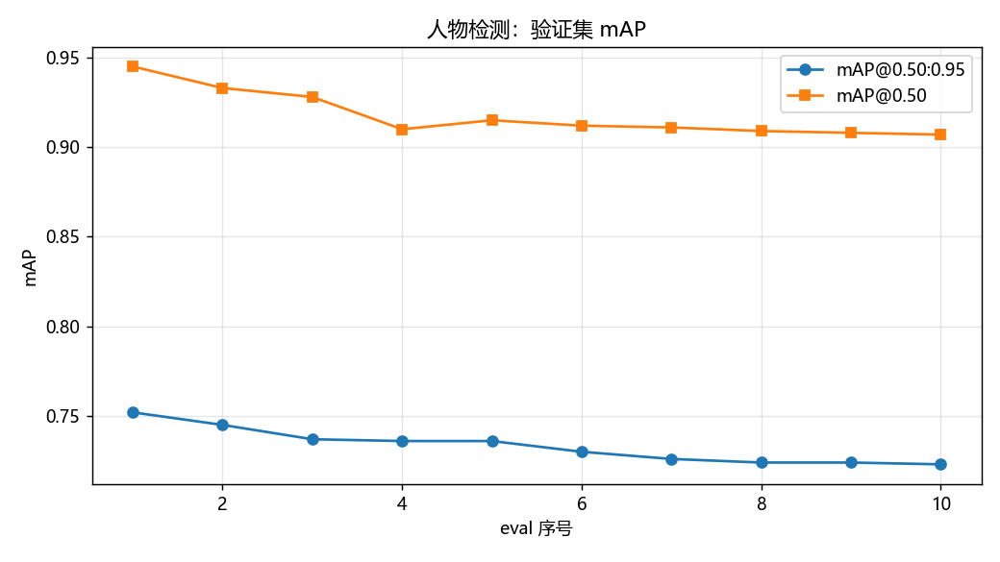
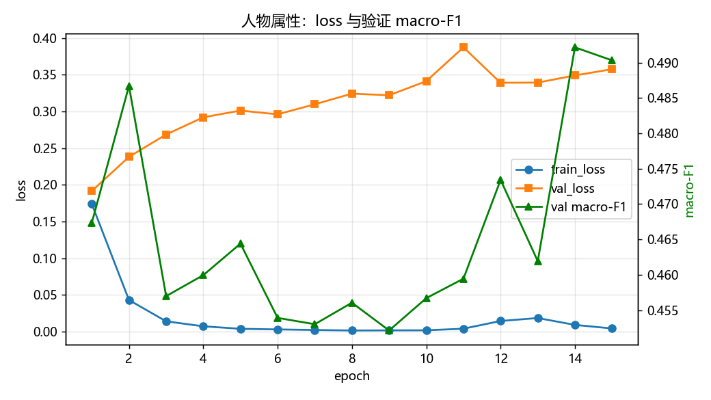
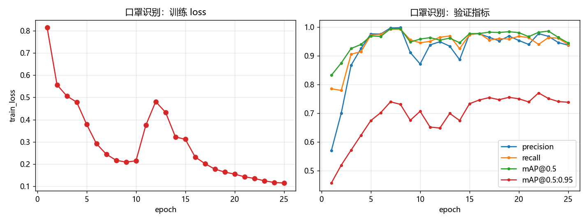

# 微调训练报告

## 数据概况（人工金标准）

| 环节 | 金标准 | train | val | test | 尘土化增强副本 |
| --- | --- | --- | --- | --- | --- |
| ① 人物检测 | 1328 图 / 6425 框 | 1242 图 / 6036 框 | 40 图 / 184 框 | 46 图 / 205 框 | 1000 图 / 4802 框 |
| ② 人物属性 | 802 图 / 802 框 | 按源图哈希划分 | - | - | 1604 图 / 1604 框 |
| ③ 口罩识别 | 1028 图 / 1028 框（含 AIZOO 原标签批量批注 800） | 按源图哈希划分 | - | - | 2056 图 / 2056 框 |

## 训练配置

| 环节 | 模型 | 起点权重 | epochs | 输出 |
| --- | --- | --- | --- | --- |
| ① 人物检测 | PP-YOLOE-S（PaddleDetection） | 官方 `mot_ppyoloe_s_36e_pipeline.pdparams` | 10 | `models/finetuned/person_detector` |
| ② 人物属性 | PP-HGNet small 26 属性（PaddleClas） | 官方 `PPHGNet_small_person_attribute_954_infer` | 15 | `models/finetuned/person_attribute` |
| ③ 口罩识别 | YOLOv5s 2 类（vendor/yolov5） | 官方 `face_mask_detection.onnx` 反建权重 | 25 | `models/finetuned/face_mask` |

## 训练曲线

## 最终指标

| 环节 | 指标 | 最佳值 |
| --- | --- | --- |
| ① 人物检测 | mAP@0.50:0.95 | 0.7520 |
| ① 人物检测 | mAP@0.50 | 0.9450 |
| ② 人物属性 | val macro-F1 | 0.4922 |
| ③ 口罩识别 | mAP@0.50 | 0.9949 |

尘土化增强只放大训练划分，标签与源一致；验证/测试集不参与增强。
